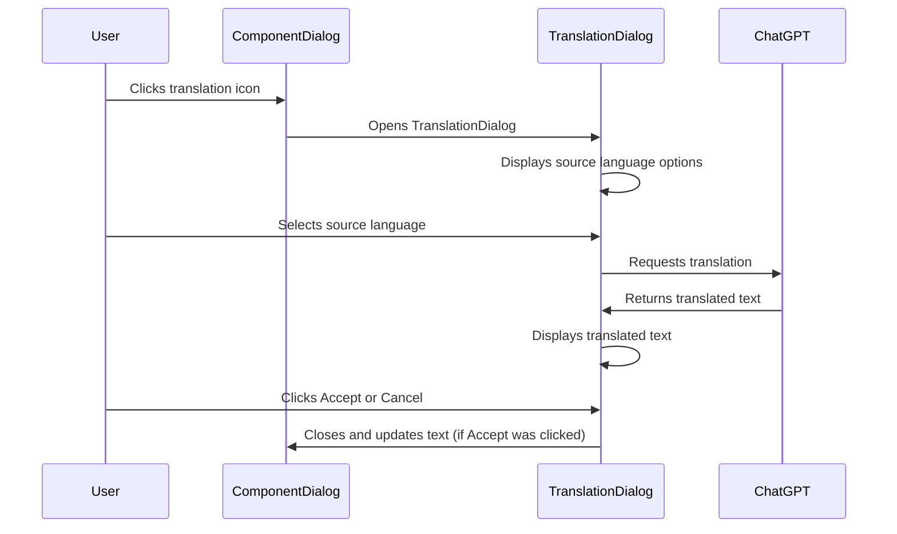
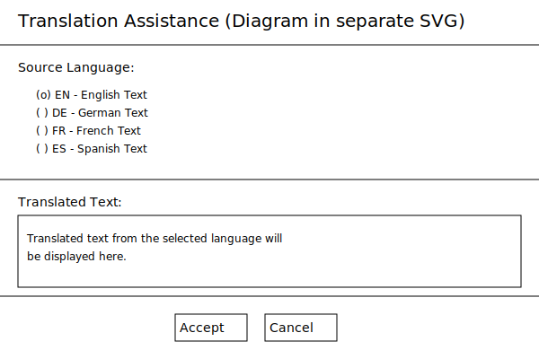
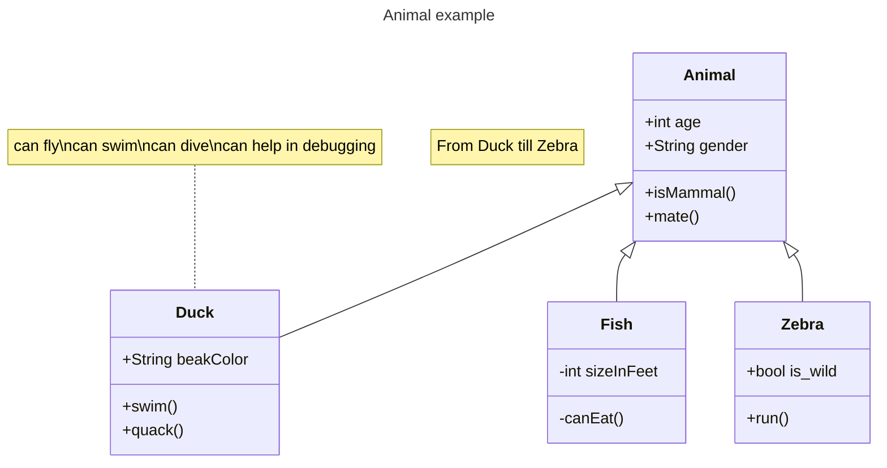
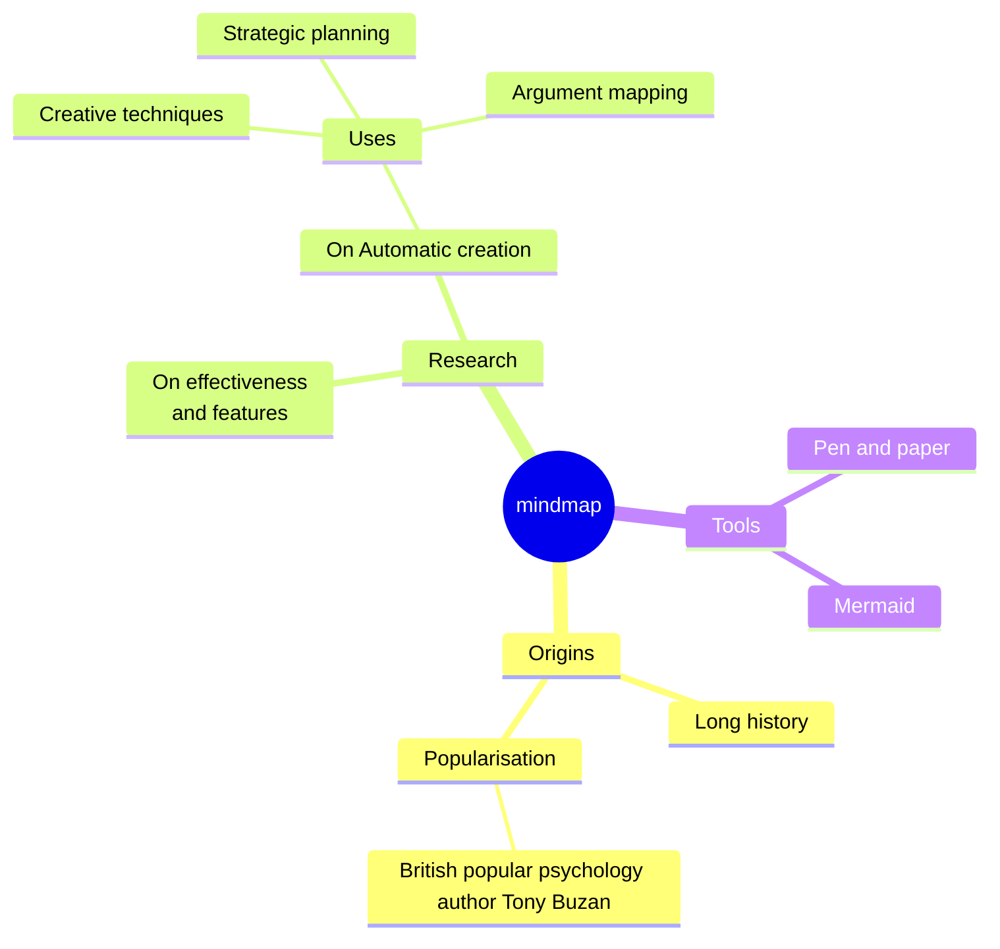
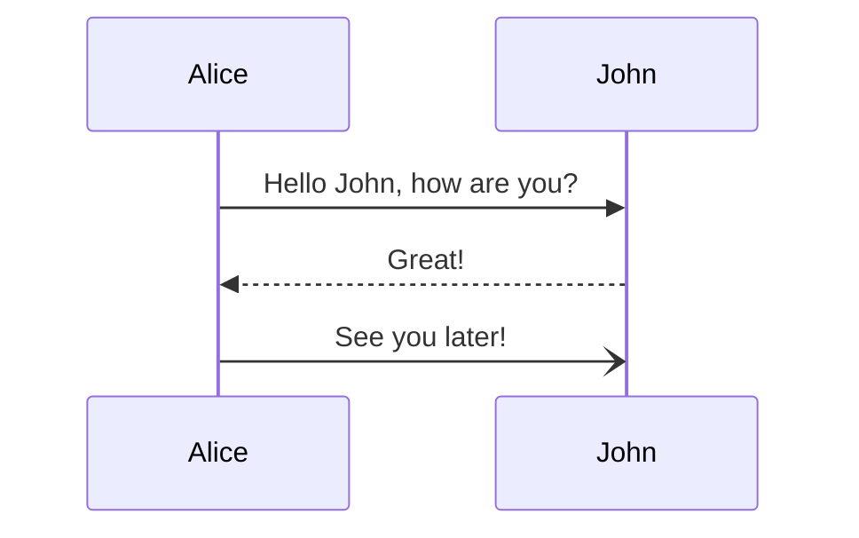

# How to draw diagrams on Github using ChatGPT

Githubs
[Markdown documentation](https://docs.github.com/en/get-started/writing-on-github/working-with-advanced-formatting/creating-diagrams)
allows creating various diagram types, like general graphs,  class diagrams or sequence diagrams using 
[mermaid](https://mermaid.js.org/) . These can be embedded directly in the markdown file. If asked, ChatGPT can 
create mermaid diagrams from what you're discussing, for instance:



If you're e.g. discussing dialog or window structures, ChatGPT can draw ascii-art for that. If you want it in a quick 
documentation, it can also output such a diagram as SVG, which can be copied into an svg file and used in the .md 
file like this: `` . The result looks like this:



---

Alternatively, in a figure:
```
<figure>
  
  <figcaption>Alternatively, as figure</figcaption>
</figure>
```

<figure>
  
  <figcaption>Alternatively, as figure</figcaption>
</figure>


## Check HTML rendering - doesn't work but should :-(

In theory, SVG might be embedded as [raw HTML fragment](https://github.github.com/gfm/#html-blocks) directly into 
the .md, but I haven't been able to make that work so far. It should work, but the tags just don't appear in the 
output, at least on the 
[rendering on Github](https://github.com/stoerr/chatGPTtools/blob/develop/misc/DiagramsOnGithub.md).

<svg width="100" height="100">
  <rect x="10" y="10" width="50" height="50" fill="blue" />
  <circle cx="75" cy="75" r="25" fill="red" />
  <text x="25" y="90" fill="black">Hello, World 1</text>
</svg> 

<figure>
<svg width="100" height="100">
  <rect x="10" y="10" width="50" height="50" fill="blue" />
  <circle cx="75" cy="75" r="25" fill="red" />
  <text x="25" y="90" fill="black">Hello, World 2</text>
</svg> 
</figure>

<figure>
  <svg width="100" height="100">
    <rect x="10" y="10" width="50" height="50" fill="blue" />
    <circle cx="75" cy="75" r="25" fill="red" />
    <text x="25" y="90" fill="black">Hello, World 3</text>
  </svg> 
</figure>

<div>
  <svg width="100" height="100">
    <rect x="10" y="10" width="50" height="50" fill="blue" />
    <circle cx="75" cy="75" r="25" fill="red" />
    <text x="25" y="90" fill="black">Hello, World in div </text>
  </svg> 
</div>

<?
how is <b>this</b> rendered? <svg width="100" height="100">
  <rect x="10" y="10" width="50" height="50" fill="blue" />
  <circle cx="75" cy="75" r="25" fill="red" />
  <text x="25" y="90" fill="black">Hello, World 4</text>
</svg> 
?>

<!
same <b>with</b> exclamation mark 
<svg width="100" height="100">
  <rect x="10" y="10" width="50" height="50" fill="blue" />
  <circle cx="75" cy="75" r="25" fill="red" />
  <text x="25" y="90" fill="black">Hello, World in ! </text>
</svg>
!>

<!-- HTML comment -->

<![CDATA[
a <b>CDATA</b> construct 
<svg width="100" height="100">
  <rect x="10" y="10" width="50" height="50" fill="blue" />
  <circle cx="75" cy="75" r="25" fill="red" />
  <text x="25" y="90" fill="black">Hello, World in cdata</text>
</svg>
]]>.


## Examples of mermaid diagrams







